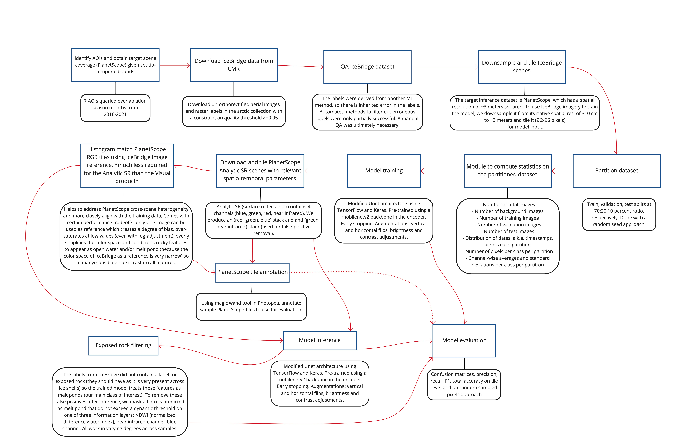

<!---- Provide an overview of what is being achieved in this repo ----> 
# <VEDA Supraglacial Segmentation>

Supraglacial lakes (SGLs), also referred to here as melt ponds, result from meltwater accumulating in topographic depressions on the surface of glaciers, primarily during the ablation season. SGLs affect ice sheet dynamics through a positive feedback loop in which the albedo-lowering effect of SGLs can escalate surface melt leading to increases in lake extent and depth, which amplify the aforementioned albedo-lowering effect. As well, fluctuations in SGLs over time can induce ice flexure and fracturing, enabling mechanisms for melt water to enter and affect the interior of the ice sheet (Arthur et al., 2020). The implications of accelerated glacial melt include increased sea level rise (Robel et al., 2019)
 and modifications to ocean primary productivity (Horvat et al., 2017). SGLs are therefore critical indicators of surface melt and its associated downstream impacts and should be monitored efficiently (Arthur et al., 2020). In situ observations and measurements of SGLs are time consuming, cost-prohibitive and difficult to achieve scalably (Lee, 2020). Earth remote sensing observation data and machine learning enable scalable monitoring of SGLs through pattern detection and quantification of lake evolution over time (Arthur et al., 2020, Hochreuther et al., 2021, Lee, 2020). Indeed, these technologies are already used in this domain.

In this work, an approach was developed using supervised semantic segmentation leveraging a convolutional neural network architecture to train a model with labels from [NASA Operation IceBridge](https://nsidc.org/data/icebridge/) and predict SGL occurrences in high temporal resolution [PlanetScope](https://www.planet.com/products/planet-imagery/?gclid=Cj0KCQjwuaiXBhCCARIsAKZLt3nxlr_6OpduNXqX_rYqbl20pNmp8HJCGCOJ2QKHfKjhk1HTt95NzBYaArbREALw_wcB) imagery. The methods developed for processing the data, training the model, evaluating the model (both on a test partition of the IceBridge imagery and on custom annotated PlanetScope imagery) and implementing the model are contained in this repo.

## Dataset

The model was trained with [NASA Operation IceBridge aerial imagery](https://nsidc.org/data/iodms0) and [labels](https://nsidc.org/data/RDSISCO4/versions/1), downsampled to approximate the spatial resolution of PlanetScope imagery (~3 meters squared). Once downsampled, the images are tiled to fixed dimensions (96x96 pixels is the upper bound given the resulting size of the downsampled images).

### IceBridge
To acquire IceBridge data at a prescribed quality threshold, run `code/NSIDCDownloader.py`.

To downsample and tile the images and labels, run `code/downsample_tile_images_labels.py`.

### PlanetScope
For inference, the PlanetScope `Analytic_SR` product should be obtained. We need all 4 of the channels (red, green, blue, near infrared).

Stack the red, green and blue to create a true color image and tile to 96x96 dimensions. The near infrared will be used later for filtering away false positives.

In some cases, histogram matching the PlanetScope scene to a reference IceBridge image helps as the calibration of IceBridge imagery is more homogenous than that of PlanetScope. To do so, run `code/utils/adjust_ps_histmatch_ic.py`.

### Partitioning

We partition the IceBridge tiled dataset into training, validation and testing partitions at a 70:20:10 ratio, respectively. This happens in the training script.

### Statistics

To compute stats on each partition, run `code/calculate_data_stats.py`. This will convey the following information:
- Number of total images
- Number of background images
- Number of training images
- Number of validation images
- Number of test images
- Distribution of dates, a.k.a. timestamps, across each partition
- Number of pixels per class per partition
- Channel-wise averages and standard deviations per class per partition

## Model

We have implemented a modified Unet architecture using TensorFlow and Keras. It is pre-trained using a mobilenetv2 backbone in the encoder. 

To train the model, run `code/train.py`.

To test the model, run `code/inference.py`. By default, this inferences on the IceBridge test partition, however you can point it to the `planetscope_image_dir` in `configs/datasets.json`.

## Evaluation

### Post-processing
The main point of the confusion for the model is exposed rock. There is plenty of it, yet the model was not trained to understand it (no dedicated label). These features often get inferred as melt ponds. We can filter the inference results using 3 approaches:

- Dynamically thresholding the near infrared channel, masking anything predicted as melt pond that does not exceed a certain threshold as background.
- Dynamically thresholding the Normalized Difference Water Index (NDWI), masking anything predicted as melt pond that does not exceed a certain threshold as background.
- Dynamically thresholding the blue infrared channel, masking anything predicted as melt pond that does not exceed a certain threshold as background.

All three work well unanymously, albeit in varying performances across samples. 

To filter using one of these three methods, run `code/utils/mask_ndwi_nir_blue.py`.

To evaluate the model, run `code/evaluate.py`. This will generate a normalized confusion matrix, class-wise and overall F1 scores as well as class-wise IoU scores. Intuitively, this script requires ground truth labels.

A second method to produce a random sampling of pixels across test images for evaluation was developed to enable cross-comparison with [Wright, N. C. and Polashenski, C. M.: Open-source algorithm for detecting sea ice surface features in high-resolution optical imagery, The Cryosphere, 12, 1307–1329, https://doi.org/10.5194/tc-12-1307-2018, 2018](https://tc.copernicus.org/articles/12/1307/2018/) and can be run at `code/utils/sample_random_pixels.py`.

#### Diagram of the workflow

## License
This project is licensed under **Apache 2**, see the [LICENSE](LICENSE) file for more details.

## References

Arthur, J. F., Stokes, C., Jamieson, S. S., Carr, J. R., & Leeson, A. A. (2020). Recent understanding of Antarctic supraglacial lakes using satellite remote sensing. Progress in Physical Geography: Earth and Environment, 44(6), 837–869. https://doi.org/10.1177/0309133320916114

C. Horvat et al. The frequency and extent of sub-ice phytoplankton blooms in the Arctic Ocean [J] Sci. Adv. (2017)
Domingue.z, R. (2010). IceBridge DMS L0 Raw Imagery, Version 1 [Data Set]. Boulder, Colorado USA. NASA National Snow and Ice Data Center Distributed Active Archive Center. https://doi.org/10.5067/UMFN22VHGGMH. Date Accessed 10-10-2022. 
 
Hochreuther, P.; Neckel, N.; Reimann, N.; Humbert, A.; Braun, M. Fully Automated Detection of Supraglacial Lake Area for Northeast Greenland Using Sentinel-2 Time-Series. Remote Sens. 2021, 13, 205. https://doi.org/10.3390/rs13020205

Polashenski, C., N. Wright, and S. McMichael. (2020). IceBridge-Related DMS-Derived L4 Sea Ice Surface Cover Classification Images, Version 1 [Data Set]. Boulder, Colorado USA. NASA National Snow and Ice Data Center Distributed Active Archive Center. https://doi.org/10.5067/FIJDWQVIDKU4. Date Accessed 10-10-2022

Robel, A. A., & Banwell, A. F. (2019). A speed limit on ice shelf collapse through hydrofracture. Geophysical Research Letters, 46, 12092– 12100. https://doi.org/10.1029/2019GL084397

S. Lee et al. Machine learning approaches to retrieve pan-Arctic melt ponds from visible satellite imagery [J] Remote Sens. Environ. (2020)

Wright, N. C. and Polashenski, C. M.: Open-source algorithm for detecting sea ice surface features in high-resolution optical imagery, The Cryosphere, 12, 1307–1329, https://doi.org/10.5194/tc-12-1307-2018, 2018.
